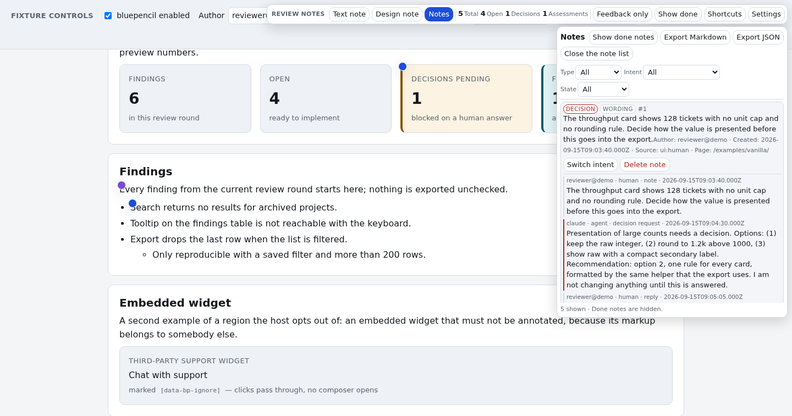

# bluepencil

> **Annotate any web app — text and design notes, anchored to the element, readable by humans *and* agents.**

A drop-in overlay that lets a reviewer (or an admin in debug mode) click any element of a
running web application, leave a note about its **content** or its **appearance**, and hand
the whole set of notes to a developer or an AI agent — no screenshots, no prose descriptions,
no "the second badge in the header".

```
┌─ your web app ───────────────────────────────────────────────┐
│  …                    ⚠ note anchored here                   │
│  [ element ]   ◇ design note: spacing is off   ✎ text note   │
└──────────────────────────────────────────────────────────────┘
        │
        ├─ export → Markdown / JSON  →  a developer or an agent works it off
        └─ thread → intent: implement | feedback   status: open | done | needs_decision
```



**Status:** `0.2.0` — the review layer, the headless data library and the CLI/MCP surfaces are on
`main`: the core model, anchoring (now including **transient container reveal**), capture, store and
the four adapters (with a conformance suite); canonical, diffable bundles with
`merge`/`upsert`/`replace-session` and migrations; Markdown/JSON export; the collaboration protocol;
the review layer with i18n; the public API and the `<bluepencil-notes>` element; the CLI, the MCP
server (read-only by default) and the reference sidecar; the vanilla fixture app with its seed
bundle, 503 unit tests and the browser legs of the embed smoke.

Honest gaps: no Playwright E2E suite against the fixture, no import/merge surface in the UI, no bulk
delete or retention control, i18n only `en`/`de`, and no npm publish — install from the tag
(`npm i github:Popoboxxo/bluepencil#v0.2.0`) or use the release artefacts. Milestones and their
state are tracked in [docs/REQUIREMENTS.md](docs/REQUIREMENTS.md), the history in
[CHANGELOG.md](CHANGELOG.md). This repository is the home of the library; the interaction model
itself is already proven in a production-used prototype (see
[docs/CONCEPT.md](docs/CONCEPT.md#7-proven-prior-art)).

## Why the name

To *blue-pencil* something means to edit it — marking up a draft with corrections and
suggestions. That is exactly what this overlay does: it is the blue pencil you hold against
a running application instead of a screenshot.

## Quick start

There is no npm release yet — build it from the repository. The library itself has **no runtime
dependencies**; the dev dependencies are for the build and the tests only.

```bash
npm install              # dev dependencies (esbuild, vitest, jsdom, typescript)
npm run build            # writes dist/ — see the artifact table below
node scripts/serve-example.mjs
# open http://localhost:9283/examples/vanilla/
```

`npm run build` writes five consumable artifacts; which one a host needs depends on how it loads
code:

| Artifact | Host type | Entry |
|---|---|---|
| `dist/bluepencil.js` (with `dist/data.js`, `dist/adapters/*.js`, `dist/i18n/*.js`) | npm dependency / bundler | the package entry — `import { init } from "bluepencil"` |
| `dist/bluepencil.iife.js` | classic `<script>` tag, bookmarklet | global `bluepencil` |
| `dist/bluepencil.element.js` | no-build host: one ES module resource (static page, CMS, Home Assistant) | defines `<bluepencil-notes>` |
| `dist/cli.js` | CLI in CI, scripts and offline exchange | `bluepencil …` (or `node dist/cli.js …`) |
| `dist/mcp.js` | MCP server over stdio, read-only by default | `node dist/mcp.js --store …` |

`dist/bluepencil.js` is the code-split ES module build — the `chunk-*.js` files next to it are its
internals, not entry points. `dist/types/**` holds the `.d.ts` declarations for every entry.

The fixture page is a small dashboard that carries every requirement group — annotate text and
design, select a quote, filter, reveal done notes, switch feedback-only mode, answer a decision
thread, export Markdown/JSON. Bulk delete (FR-8.2) and session purge (FR-8.3) are M2 work and have
no control in the fixture. The checklist for a manual round is in
[examples/vanilla/README.md](examples/vanilla/README.md).

On your own page it is one call — with the classic build from the table above (a bundler host
uses `import { init } from "bluepencil"` instead and has no global):

```html
<script src="/dist/bluepencil.iife.js"></script>
<script>
  bluepencil.init({
    enabled: () => me.roles.includes("admin"),   // re-checked on every enable(); fail closed
    adapter: "localStorage",                     // or httpAdapter({ endpoint: "/api/v1/bluepencil" })
    getRoute: () => location.pathname + location.search,
  });
</script>
```

`init()` returns a handle the host can switch at runtime, without a reload:

```ts
const bp = init({ enabled: () => flags.uiNotes, adapter: "localStorage" });

bp.enable();                        // attach the layer
bp.disable();                       // remove nodes, listeners, styles — idempotent
bp.export({ format: "markdown" });  // the agent-facing export
await bp.destroy();                 // final cleanup
```

Next stops: [docs/INTEGRATION.md](docs/INTEGRATION.md) for the modes, host hooks, theming and the
admin debug pattern; [docs/ARCHITECTURE.md](docs/ARCHITECTURE.md#2-public-api-sketch) and
[docs/INTERNAL-API.md](docs/INTERNAL-API.md) §9 for the full API.

## Documentation

| Document | Content |
|---|---|
| [docs/CONCEPT.md](docs/CONCEPT.md) | Problem, users, use cases, core concepts, anchoring, deployment modes, non-goals, roadmap |
| [docs/REQUIREMENTS.md](docs/REQUIREMENTS.md) | Functional and non-functional requirements with priorities and acceptance criteria |
| [docs/ARCHITECTURE.md](docs/ARCHITECTURE.md) | Module layout, data model, storage adapters, HTTP contract, bookmarklet, test strategy |
| [docs/PROTOCOL.md](docs/PROTOCOL.md) | Normative rules for human + agent collaboration (implement / feedback / decision requests) |
| [docs/INTEGRATION.md](docs/INTEGRATION.md) | Integration modes, host hooks, theming, security notes, admin debug mode |
| [docs/INTERNAL-API.md](docs/INTERNAL-API.md) | Frozen module boundaries and the public API sketch for M1 (`0.1.0`) |
| [examples/vanilla/README.md](examples/vanilla/README.md) | The fixture app: smoke commands, hook inventory, seed bundle, manual checklist |
| [docs/PROTOCOL.md](docs/PROTOCOL.md) §8 | Environment tagging, bundle exchange rules, promotion between dev and live |

## What it will be, in one paragraph

`bluepencil` is a small, framework-agnostic library (TypeScript, no runtime dependencies) that
injects a review layer into any web page. It resolves a stable anchor for every note
(`data-*` hook → CSS path → text quote), captures the element's *current* state for design
notes (computed styles, box, theme, viewport, build reference), and stores notes behind a
swappable transport adapter (in-memory, `localStorage`, file, HTTP API, MCP). Notes carry an
**intent** (`implement` or `feedback`) and a **status** (`open`, `done`, `needs_decision`) plus
a **thread** of human and agent messages — so an AI agent can read the set, implement what is
unambiguous, ask for a decision where it is not, and report back in the same thread.

## Two more things it must do

**Work where the code runs.** On a developer system the layer reads *and* writes: a test runner,
build script or agent can drop notes into the running app (with their origin attached), while a
human reads them in the UI. In a live system it is admin-only and invisible to everyone else.

**Be readable by agents.** An **MCP interface** is a required part of the final tool (not a
nice-to-have): an agent can list open notes, answer one, mark it done, and move bundles —
read-only by default, writes on explicit opt-in, always bound to one app *and* one environment.

**Let notes travel.** Sets of notes move between environments as portable bundles —
`schema`-versioned JSON with an environment tag, importable with `merge` / `upsert` /
`replace-session`, a dry run that reports conflicts instead of overwriting, and a deliberate
*promotion* path from `dev` to `live` and back. The reading and writing logic lives in a
DOM-free data library with a CLI (`bluepencil/data`, `bluepencil/cli`) so CI, scripts and agents
use exactly the same data and validators as the UI.

## Non-negotiables

* **Zero layout impact** when disabled — no payload, no listeners, no polling.
* **Never enabled for normal end users.** The host decides via `enabled()` (admin role, flag) —
  and that decision is re-checked on every runtime activation.
* **Switchable at runtime.** `enable()` / `disable()` work in a running product; disabling leaves
  no DOM, no listeners, no data behind.
* **The anchor survives a text edit** — otherwise the notes are worthless after the first revision.
* **Agent-readable by design**: the Markdown export *is* the interface; the headless data
  library lets agents and CI read and write the same note sets without a browser.
* **No lock-in**: no hosted service, no account, self-hostable in a few lines.

## Privacy & secrets

* **No credentials.** The library stores and transmits none of its own — no account, no token, no
  session. The only requests that leave the page are the ones the host configured through an
  adapter (FR-9.1, NFR-7), and note text is rendered as text, never as HTML (FR-9.3).
* **Notes may contain internal wording.** A note is a review artefact, not a data store; treat it as
  if it names internal features, customers or drafts. The policy is **"no personal data in notes"**:
  purge a round once it is worked off, and prefer the local (`localStorage`) or file adapter when in
  doubt (NFR-13).
* **Review data is never committed.** `.gitignore` excludes `*.bluepencil.json`; the fixture's seed
  bundle is the single deliberate exception (`!examples/vanilla/data/seed.bluepencil.json`). The same
  rule applies to bundles handed to CI or checked into a repo.
* **No self-deletion.** The browser library never deletes notes on its own (D5): bulk delete
  (FR-8.2, M2) and retention (FR-8.4, M4) are not part of M1.

The pipeline keeps these claims checkable: `.github/workflows/ci.yml` runs the typecheck, the unit
tests, the build, the size guard, the CLI/MCP/packaging smoke scripts (`scripts/cli-smoke.mjs`,
`scripts/mcp-smoke.mjs`, `scripts/pack-smoke.mjs`) and the secret scan. The same chain minus the
process-level smokes is local: `npm run verify`.

## License

MIT — see [LICENSE](LICENSE).
