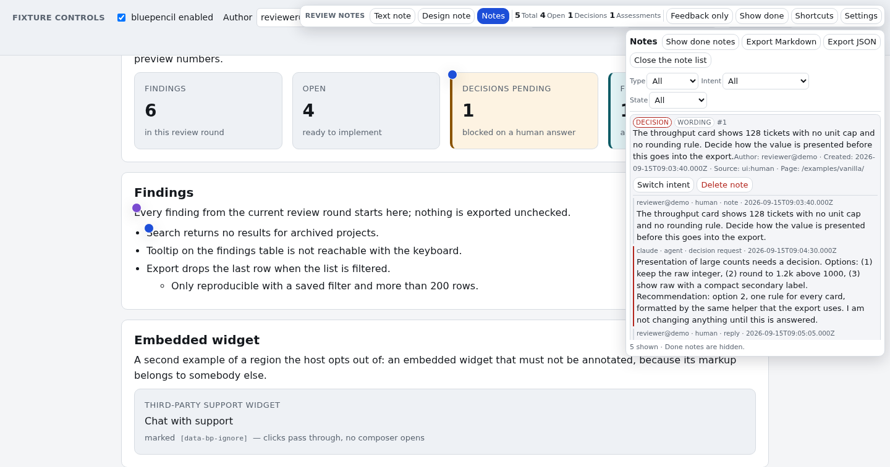

# bluepencil

> **Annotate any web app — text and design notes, anchored to the element, readable by humans *and* agents.**

A drop-in overlay that lets a reviewer (or an admin in debug mode) click any element of a
running web application, leave a note about its **content** or its **appearance**, and hand
the whole set of notes to a developer or an AI agent — no screenshots, no prose descriptions,
no "the second badge in the header".

```
┌─ your web app ───────────────────────────────────────────────┐
│  …                    ⚠ note anchored here                   │
│  [ element ]   ◇ design note: spacing is off   ✎ text note   │
└──────────────────────────────────────────────────────────────┘
        │
        ├─ export → Markdown / JSON  →  a developer or an agent works it off
        └─ thread → intent: implement | feedback   status: open | done | needs_decision
```



**Status:** `0.4.0` — the review layer, the headless data library and the CLI/MCP surfaces are on
`main`: the core model, anchoring (now including **transient container reveal**), capture, store and
the four adapters (with a conformance suite); canonical, diffable bundles with
`merge`/`upsert`/`replace-session` and migrations; Markdown/JSON export; the collaboration protocol;
the review layer with i18n; the public API and the `<bluepencil-notes>` element; the CLI, the MCP
server (read-only by default) and the reference sidecar, which now takes **per-device signed tokens**
(shared secret or token, per-environment and revocable); a **Chromium MV3 extension** that mounts the
layer in pages you do not build yourself, with its settings reaching the layer and its rounds kept in
the extension's own storage; the vanilla fixture app with its seed bundle, 675 unit tests and the
browser legs of the embed smoke, the E2E suite and the extension smoke.

Honest gaps: the E2E suite is hand-rolled over the CDP pipe rather than Playwright (NFR-4 says no
test framework), token refresh is manual (an expired token is replaced by hand, and revocation is
read at sidecar start), no import/merge surface in the UI, no bulk delete or retention control, i18n
only `en`/`de`, and no npm publish — install from the tag
(`npm i github:Popoboxxo/bluepencil#v0.4.0`; the `prepare` script builds `dist/` during install) or
use the release artefacts: loader, layer, package tarball, the MV3 browser extension and one
`SHA256SUMS` over all of them. How a release is cut: [docs/RELEASING.md](docs/RELEASING.md).
Milestones and their state are tracked in [docs/REQUIREMENTS.md](docs/REQUIREMENTS.md), the history in
[CHANGELOG.md](CHANGELOG.md). This repository is the home of the library; the interaction model
itself is already proven in a production-used prototype (see
[docs/CONCEPT.md](docs/CONCEPT.md#7-proven-prior-art)).

## Why the name

To *blue-pencil* something means to edit it — marking up a draft with corrections and
suggestions. That is exactly what this overlay does: it is the blue pencil you hold against
a running application instead of a screenshot.

## Quick start

There is no npm release yet — build it from the repository. The library itself has **no runtime
dependencies**; the dev dependencies are for the build and the tests only. The toolchain needs
**Node 22.12 or newer** — that is what Vitest 5 requires, and on an older release the test suite dies
inside a transitive dependency with a message that names neither Node nor Vitest.

```bash
npm install              # dev dependencies; the `prepare` script then builds dist/
npm run build            # re-run it after changing src/
node scripts/serve-example.mjs
# open http://localhost:9283/examples/vanilla/
```

`npm run build` writes the artefacts below; which one a host needs depends on how it loads code:

| Artifact | Host type | Entry |
|---|---|---|
| `dist/bluepencil.js` (with `dist/data.js`, `dist/adapters/*.js`, `dist/i18n/*.js`) | npm dependency / bundler | the package entry — `import { init } from "bluepencil"` |
| `dist/bluepencil.iife.js` | classic `<script>` tag, bookmarklet | global `bluepencil` |
| `dist/bluepencil.element.js` and `.min.js` | no-build host: one ES module resource (static page, CMS, Home Assistant) | defines `<bluepencil-notes>` |
| `dist/bluepencil.element.iife.js` | classic script — the browser extension's MAIN world | global `bluepencilElement` |
| `dist/attach.js` (classic) and `dist/attach.esm.js` (bundler) | the one-tag attach loader | `window.bluepencilAttach` |
| `dist/cli.js` | CLI in CI, scripts and offline exchange | `bluepencil …` (or `node dist/cli.js …`) |
| `dist/mcp.js` | MCP server over stdio, read-only by default | `node dist/mcp.js --store …` |
| `dist/server.js` | the reference sidecar: static site *and* notes API on one port | `node dist/server.js --store …` |

`dist/bluepencil.js` is the code-split ES module build — the `chunk-*.js` files next to it are its
internals, not entry points. `dist/bluepencil.core.js` is the NFR-3 size measurement (the built-in
adapters aliased away), not something a host loads. `dist/types/**` holds the `.d.ts` declarations for
every entry.

The fixture page is a small dashboard that carries every requirement group — annotate text and
design, select a quote, filter, reveal done notes, switch feedback-only mode, answer a decision
thread, export Markdown/JSON. Bulk delete (FR-8.2) and session purge (FR-8.3) are M2 work and have
no control in the fixture. The checklist for a manual round is in
[examples/vanilla/README.md](examples/vanilla/README.md).

On your own page it is one call — with the classic build from the table above (a bundler host
uses `import { init } from "bluepencil"` instead and has no global):

```html
<script src="/dist/bluepencil.iife.js"></script>
<script>
  bluepencil.init({
    enabled: () => me.roles.includes("admin"),   // re-checked on every enable(); fail closed
    adapter: "localStorage",                     // or httpAdapter({ endpoint: "/api/v1/bluepencil" })
    getRoute: () => location.pathname + location.search,
  });
</script>
```

`init()` returns a handle the host can switch at runtime, without a reload:

```ts
const bp = init({ enabled: () => flags.uiNotes, adapter: "localStorage" });

bp.enable();                        // attach the layer
bp.disable();                       // remove nodes, listeners, styles — idempotent
bp.export({ format: "markdown" });  // the agent-facing export
await bp.destroy();                 // final cleanup
```

Next stops: [docs/INTEGRATION.md](docs/INTEGRATION.md) for the modes, host hooks, theming and the
admin debug pattern; [docs/ARCHITECTURE.md](docs/ARCHITECTURE.md#2-public-api-sketch) and
[docs/INTERNAL-API.md](docs/INTERNAL-API.md) §9 for the full API.

## Ways to put it on a page

Getting the layer *in* and deciding where the notes *live* are two separate choices, and the second
one is what makes a round local to one browser or shared with a server.

| How it gets in | What you add | Works when |
|---|---|---|
| **npm dependency** | `import { init } from "bluepencil"`, with `bluepencil/data`, `bluepencil/element`, `bluepencil/attach` and `bluepencil/adapters/*` as subpaths | you own the app and build it: tree-shaken, and a host pays only for the adapter it uses |
| **Classic `<script>`** | `dist/bluepencil.iife.js` → global `bluepencil` | a page with no build step of its own |
| **One tag, any host** | `dist/attach.js` plus `data-*` attributes; it defines `<bluepencil-notes>` and mounts it | static page, CMS, Home Assistant resource — nothing to build, nothing to call |
| **The element alone** | `dist/bluepencil.element.min.js` and a `<bluepencil-notes …>` tag you place yourself | you want to control when and where it mounts, and to read its events |
| **Bookmarklet** | a bookmark pointing at the IIFE build | the page is not yours and you cannot deploy it — see the CSP notes in [INTEGRATION §4](docs/INTEGRATION.md#4-bookmarklet-no-deploy) |
| **Self-hosted sidecar** | `node dist/server.js --store notes.json --root <dir>` | you want persistence and one shared store without writing a backend |
| **Chromium extension** | load `extension/dist` unpacked — see the next section | any page, without editing it |
| **Headless** | the `bluepencil` CLI, `node dist/mcp.js`, `bluepencil/data` | CI, scripts and agents, against the same data and validators as the UI |

Where the notes land is a separate switch, the adapter:

| Adapter | Survives | Notes |
|---|---|---|
| `memory` | nothing — it is the default | the layer is an overlay, not a store |
| `localStorage` | a reload, in that browser | namespaced `bluepencil:<host>:<instance>:v1`; the bookmarklet's default; partitioned per origin |
| `chromeStorage` | a reload, in that browser profile, across every site | the extension's default, and the reason that adapter exists |
| `file` | whatever the host's I/O does | needs an injected `{ read, write }` — `createFileAdapter({ … })`, because there is no sensible default file to write to |
| `http` | a server | speaks the documented contract, so *any* backend works; `dist/server.js` implements it |

An HTTP store is also what makes a round visible to the MCP server, and the contract is small on
purpose — ten endpoints, listed in [docs/EMBED.md](docs/EMBED.md#4-the-store-contract), which is also
where the attribute table, the loader API and the update manifest live.

## The browser extension

The MV3 extension mounts the same layer the attach tag does, on any page, without editing that page.
It is the only mode whose configuration is a UI instead of markup.

### What you need

* A Chromium-based browser, **Chrome 116 or newer** — `minimum_chrome_version` in
  `extension/manifest.json`.
* A built library first: the extension loads `dist/bluepencil.element.iife.js` verbatim, so
  `npm run build:ext` refuses to run without it.

```sh
npm run build && npm run build:ext     # writes extension/dist/
```

Then `chrome://extensions` → *Developer mode* → *Load unpacked* → `extension/dist`.

From a release you build nothing: every push to `main` attaches the packaged extension as a workflow
artefact, and a `v*` tag attaches `bluepencil-extension-<version>.zip` to the release. That zip is the
content of `extension/dist`, which is exactly what *Load unpacked* takes — see
[docs/RELEASING.md](docs/RELEASING.md).

### What it does

* The toolbar button (**Alt+Shift+B** by default, rebindable under `chrome://extensions/shortcuts`)
  mounts the layer on the tab you are looking at. Nothing runs on a page you did not ask for.
* The options page has *Turn on here* / *Turn off here* for the current tab. Switching off sets the
  element's `enabled="false"` rather than removing it, so open notes survive and the layer comes back
  without a second injection.
* A page can drive the same path instead of the toolbar, which is how a host app offers its own
  "annotate this page" button:

```js
window.postMessage({ source: "bluepencil-page", kind: "request-mount" }, window.location.origin);
// kind: "toggle" with { enabled: false, requestId: "1" } switches it; the reply arrives on the same
// channel tagged with your requestId — read it in a later turn, never by awaiting inside the same one.
```

* The layer mounts in the page's **MAIN world**, because an isolated content-script world has no usable
  `customElements` to register the element in. That is also why the extension does **not** get around
  a page's CSP: the layer works *inside* the policy (falling back to constructable stylesheets when
  `style-src` forbids inline styles), it does not bypass it.

### Settings

The options page writes one object into `chrome.storage.local` (key `bluepencil:settings`), which the
service worker reads on every mount. `extension/src/settings.ts` validates it field by field, so a
hand-edited or older blob cannot put the layer into a state the worker would reject, and an unknown
value is replaced by the documented default rather than stored.

| Field | Values | What it decides |
|---|---|---|
| Environment | `dev`, `staging`, `prod` | the badge the layer shows on each note |
| App name | free text | what the layer calls the app; empty falls back to the page's own title |
| Language | `auto`, `en`, `de` | `auto` follows the browser |
| Author | "ask me once, then remember", "take it from the page" | how the note's author is established. Neither is verified — the store has no authentication of its own |
| Where notes are kept | in the extension (shared across all sites), in the page (per site), in this tab only (lost on reload), on a sidecar (shared with an agent) | which adapter the layer uses |
| Sidecar URL | a URL | read only when the store is *on a sidecar* |

The two credential fields appear only for a sidecar, and the page describes what you selected as you
select it — including, for a signed token, whether it has already expired.

### Which connections you can point it at

Four stores, and for the sidecar three credential modes. Those modes are the point of the page: they
are *different headers*, so picking the wrong one produces a `401` that reads like a dead server.

| Authentication | Header sent | The sidecar needs | Trade-off |
|---|---|---|---|
| **None** | – | nothing at all | right **only on loopback**; from the moment `--host` leaves it, the credential is the only thing between the network and your notes |
| **Shared secret** | `x-bluepencil-auth: <secret>` | `--auth-secret` / `BLUEPENCIL_AUTH_SECRET` | one string every client shares: no expiry, and withdrawing it means rotating it everywhere at once |
| **Signed token** | `Authorization: Bearer <token>` | `--token-key` / `BLUEPENCIL_TOKEN_KEY` | per device, expiring, revocable on its own — the right choice as soon as more than one device is involved |

```sh
# the sidecar, reachable from another device
export BLUEPENCIL_TOKEN_KEY=…                    # the same value on both sides
node dist/server.js --store notes.json --host 0.0.0.0 --revoked-tokens revoked.json

# one credential per device — minted locally, never over the wire
bluepencil token --device work-laptop --scope read --ttl 43200
```

`bluepencil token` prints the token on stdout and everything else on stderr (device, scope, expiry,
and the **id** that belongs in `--revoked-tokens`), so `export TOKEN=$(bluepencil token --device
laptop)` works. Paste the token into the options page and keep the device name: it is recorded in the
token, and it is what keeps a revocation list readable by a human. The page then reads the expiry out
of the token and says *"Expires in about 6 h 12 min"*, that the token has expired, or plainly that the
expiry could not be read — a warning, not a decision, because only the sidecar decides whether a token
is good. The refusals come back as themselves: `401 unauthorized`, `401 token_expired` (mint a new
one), `401 token_revoked` (**do not** — the device was deliberately cut off), `403 insufficient_scope`
(the token is valid but read-only).

The full credential story is in [docs/EXTENSION.md](docs/EXTENSION.md), and the sidecar side — both
phases, the revocation file and why the environment variable beats the flag — in
[INTEGRATION §5](docs/INTEGRATION.md#authentication--and-when-it-is-needed).

### Permissions

| Permission | Why |
|---|---|
| `activeTab` | inject only into the tab you asked for; the grant expires when you leave |
| `scripting` | inject the layer and the bridge |
| `storage` | `chrome.storage.local` |
| `tabs` | resolve the active tab's URL |
| `http://*/*`, `https://*/*` | host access, granted up front |

`file:///*` is deliberately **not** requested, and `<all_urls>` is not used.

**Known gap:** the settings do not reach the layer yet
([#53](https://github.com/Popoboxxo/bluepencil/issues/53)). The worker writes them onto
`<bluepencil-notes>` with a `data-` prefix, which is the *loader's* vocabulary — not the element's — so
the layer falls back to its default `memory` store and a round taken with the extension does not
survive a reload.

## Documentation

| Document | Content |
|---|---|
| [docs/CONCEPT.md](docs/CONCEPT.md) | Problem, users, use cases, core concepts, anchoring, deployment modes, non-goals, roadmap |
| [docs/REQUIREMENTS.md](docs/REQUIREMENTS.md) | Functional and non-functional requirements with priorities and acceptance criteria |
| [docs/ARCHITECTURE.md](docs/ARCHITECTURE.md) | Module layout, data model, storage adapters, HTTP contract, bookmarklet, test strategy |
| [docs/PROTOCOL.md](docs/PROTOCOL.md) | Normative rules for human + agent collaboration (implement / feedback / decision requests) |
| [docs/INTEGRATION.md](docs/INTEGRATION.md) | Integration modes, host hooks, theming, security notes, admin debug mode |
| [docs/EMBED.md](docs/EMBED.md) | One-tag attach: attribute reference, loader/update API, the store's endpoint table, the gate recipe |
| [docs/INTERNAL-API.md](docs/INTERNAL-API.md) | Frozen module boundaries and the public API sketch for M1 (`0.1.0`) |
| [docs/EXTENSION.md](docs/EXTENSION.md) | The Chromium MV3 extension: build, install, and how it gets past a page's CSP |
| [docs/HERMES.md](docs/HERMES.md) | Registering the MCP server in a host, and the environment binding it runs under |
| [docs/RELEASING.md](docs/RELEASING.md) | How a release is cut: preflight, the tag-triggered workflow, the five assets |
| [examples/vanilla/README.md](examples/vanilla/README.md) | The fixture app: smoke commands, hook inventory, seed bundle, manual checklist |
| [docs/PROTOCOL.md](docs/PROTOCOL.md) §8 | Environment tagging, bundle exchange rules, promotion between dev and live |

## What it will be, in one paragraph

`bluepencil` is a small, framework-agnostic library (TypeScript, no runtime dependencies) that
injects a review layer into any web page. It resolves a stable anchor for every note
(`data-*` hook → CSS path → text quote), captures the element's *current* state for design
notes (computed styles, box, theme, viewport, build reference), and stores notes behind a
swappable transport adapter (memory, `localStorage`, `chromeStorage`, file, HTTP, and through HTTP an
MCP server). Notes carry an
**intent** (`implement` or `feedback`) and a **status** (`open`, `done`, `needs_decision`) plus
a **thread** of human and agent messages — so an AI agent can read the set, implement what is
unambiguous, ask for a decision where it is not, and report back in the same thread.

## Two more things it must do

**Work where the code runs.** On a developer system the layer reads *and* writes: a test runner,
build script or agent can drop notes into the running app (with their origin attached), while a
human reads them in the UI. In a live system it is admin-only and invisible to everyone else.

**Be readable by agents.** An **MCP interface** is a required part of the final tool (not a
nice-to-have): an agent can list open notes, answer one, mark it done, and move bundles —
read-only by default, writes on explicit opt-in, always bound to one app *and* one environment.

**Let notes travel.** Sets of notes move between environments as portable bundles —
`schema`-versioned JSON with an environment tag, importable with `merge` / `upsert` /
`replace-session`, a dry run that reports conflicts instead of overwriting, and a deliberate
*promotion* path from `dev` to `live` and back. The reading and writing logic lives in a
DOM-free data library with a CLI (`bluepencil/data` when imported, the `bluepencil` binary in a shell)
so CI, scripts and agents use exactly the same data and validators as the UI.

## Non-negotiables

* **Zero layout impact** when disabled — no payload, no listeners, no polling.
* **Never enabled for normal end users.** The host decides via `enabled()` (admin role, flag) —
  and that decision is re-checked on every runtime activation.
* **Switchable at runtime.** `enable()` / `disable()` work in a running product; disabling leaves
  no DOM, no listeners, no data behind.
* **The anchor survives a text edit** — otherwise the notes are worthless after the first revision.
* **Agent-readable by design**: the Markdown export *is* the interface; the headless data
  library lets agents and CI read and write the same note sets without a browser.
* **No lock-in**: no hosted service, no account, self-hostable in a few lines.

## Privacy & secrets

* **No credentials of its own.** The library stores and transmits none — no account, no token, no
  session. The only requests that leave the page are the ones the host configured through an
  adapter (FR-9.1, NFR-7), and note text is rendered as text, never as HTML (FR-9.3). A credential a
  *sidecar* needs arrives the same way any other host setting does: through the adapter's headers or
  the element's `token`/`token-header`/`token-scheme` attributes, or through the extension's options
  page. The sidecar is where that credential is checked — one shared secret (`--auth-secret`) or
  signed, expiring, revocable per-device tokens (`--token-key`, minted with `bluepencil token`);
  [docs/INTEGRATION.md](docs/INTEGRATION.md) §5 has both.
* **Notes may contain internal wording.** A note is a review artefact, not a data store; treat it as
  if it names internal features, customers or drafts. The policy is **"no personal data in notes"**:
  purge a round once it is worked off, and prefer the local (`localStorage`) or file adapter when in
  doubt (NFR-13).
* **Review data is never committed.** `.gitignore` excludes `*.bluepencil.json`; the fixture's seed
  bundle is the single deliberate exception (`!examples/vanilla/data/seed.bluepencil.json`). The same
  rule applies to bundles handed to CI or checked into a repo.
* **No self-deletion.** The browser library never deletes notes on its own (D5): bulk delete
  (FR-8.2, M2) and retention (FR-8.4, M4) are not part of M1.
* **The store-facing policy is [docs/PRIVACY.md](docs/PRIVACY.md).** It is the privacy policy
  published with the extension, and it carries the required Limited Use statement: *the use of
  information received from Google APIs will adhere to the Chrome Web Store User Data Policy,
  including the Limited Use requirements.* The dashboard copy lives in
  [docs/WEBSTORE.md](docs/WEBSTORE.md), and `npm run smoke:webstore` keeps the manifest, the shipped
  code and that copy in step.

The pipeline keeps these claims checkable: `.github/workflows/ci.yml` runs the typecheck, the unit
tests, the build, the size guard, the CLI/MCP/packaging smoke scripts (`scripts/cli-smoke.mjs`,
`scripts/mcp-smoke.mjs`, `scripts/pack-smoke.mjs`) and the secret scan. The same chain minus the
process-level smokes is local: `npm run verify`.

## License

MIT — see [LICENSE](LICENSE).
